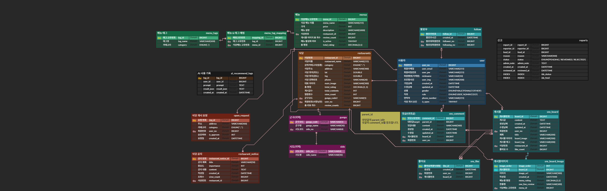

# HoSu 🍯

## 프로젝트 소개

HoSu는 맛집 정보를 요약하여 제공하는 AI 기반 맛집 추천 플랫폼입니다. 사용자는 음식점을 검색하고, 리뷰를 작성하며, AI를 활용한 개인화된 맛집 추천을 받을 수 있습니다.

### 주요 기능
- 🔍 **지역 및 카테고리 기반 맛집 검색**: 다양한 필터를 통한 맞춤형 검색
- 🤖 **AI 기반 맛집 추천**: OpenAI를 활용한 개인화된 추천 시스템
- ✍️ **리뷰 & SNS 기능**: 음식점 리뷰 작성, 팔로우, 피드 공유
- 👨‍💼 **사장님 페이지**: 음식점 관리, 메뉴 등록, 공지사항 관리
- 👤 **관리자 페이지**: 사용자 관리, 콘텐츠 관리, 음식점 승인 시스템
- 🗺️ **카카오맵 연동**: 음식점 위치 시각화 및 검색

---

## 기술 스택

### Frontend
- **Framework**: Vue.js 3.5.25
- **State Management**: Pinia 3.0.4
- **Build Tool**: Vite 7.2.4
- **HTTP Client**: Axios 1.13.2
- **Router**: Vue Router 4.6.3
- **Maps**: vue3-kakao-maps 2.3.10
- **Node Version**: ^20.19.0 || >=22.12.0

### Backend
- **Framework**: Spring Boot 3.5.7
- **Language**: Java 17
- **Database**: MySQL 8.x
- **ORM**: MyBatis 3.0.3
- **Build Tool**: Maven
- **Authentication**: JWT (JSON Web Token)
- **External APIs**:
  - Kakao Map API
  - OpenAI API
  - AWS S3 (이미지 스토리지)

---

## 프로젝트 버전

| 구분 | 버전 |
|------|------|
| **Frontend** | 0.0.0 (개발 중) |
| **Backend** | 0.0.1-SNAPSHOT |
| **Spring Boot** | 3.5.7 |
| **Vue.js** | 3.5.25 |
| **Java** | 17 |
| **Node.js** | ^20.19.0 \|\| >=22.12.0 |

---

## ERD (Entity Relationship Diagram)



---

## 시작하기

### 필수 요구사항

#### 1. 개발 환경
- **Node.js**: 20.19.0 이상 또는 22.12.0 이상
- **Java**: JDK 17
- **MySQL**: 8.x
- **Maven**: 3.6 이상

#### 2. API 키 (필수)
프로젝트 실행을 위해 다음 API 키들이 필요합니다:

| API | 용도 | 발급 방법 |
|-----|------|----------|
| **Kakao API Key** | 지도 검색 및 위치 정보 | [Kakao Developers](https://developers.kakao.com/) |
| **OpenAI API Key** | AI 기반 맛집 추천 | [OpenAI Platform](https://platform.openai.com/) |
| **AWS S3 Credentials** | 이미지 저장소 | [AWS Console](https://console.aws.amazon.com/) |
| **JWT Secret** | 사용자 인증 | 임의의 256bit 비밀키 생성 |

### 설치 및 실행

#### 1. 프로젝트 클론
```bash
git clone https://github.com/Swimming-Yang/HoSu.git
cd HoSu
```

#### 2. 데이터베이스 설정
```bash
# MySQL 데이터베이스 생성
mysql -u root -p
CREATE DATABASE hosu_db CHARACTER SET utf8mb4 COLLATE utf8mb4_unicode_ci;

# 사용자 생성 및 권한 부여
CREATE USER 'ssafy'@'localhost' IDENTIFIED BY 'your_password';
GRANT ALL PRIVILEGES ON hosu_db.* TO 'ssafy'@'localhost';
FLUSH PRIVILEGES;
```

#### 3. 백엔드 설정

##### 3.1. application.properties 설정
`HoSu_Project/HoSu/src/main/resources/application.properties` 파일에 환경 변수를 설정합니다.

```properties
# 데이터베이스 설정
spring.datasource.url=jdbc:mysql://localhost:3307/hosu_db?serverTimezone=UTC&characterEncoding=UTF-8
spring.datasource.username=ssafy
spring.datasource.password=your_db_password

# API 키 설정
kakao.api.key=your_kakao_api_key
openai.api.key=your_openai_api_key
jwt.secret=your_jwt_secret_key

# AWS S3 설정
aws.access-key-id=your_aws_access_key_id
aws.secret-access-key=your_aws_secret_access_key
aws.region=ap-northeast-2
cloud.aws.s3.bucket=your_bucket_name
```

##### 3.2. 백엔드 실행
```bash
cd HoSu_Project/HoSu
mvn clean install
mvn spring-boot:run
```

서버는 기본적으로 `http://localhost:8080`에서 실행됩니다.

#### 4. 프론트엔드 설정

##### 4.1. 환경 변수 설정
`Hosu_Frontend/.env` 파일을 생성하고 다음을 추가합니다:

```env
VITE_KAKAO_MAP_API_KEY=your_kakao_api_key
VITE_API_BASE_URL=http://localhost:8080
```

##### 4.2. 의존성 설치 및 실행
```bash
cd Hosu_Frontend
npm install
npm run dev
```

애플리케이션은 `http://localhost:5173`에서 실행됩니다.

---

## 프로젝트 구조

```
HoSu/
├── HoSu_Project/              # 백엔드 (Spring Boot)
│   └── HoSu/
│       ├── src/
│       │   ├── main/
│       │   │   ├── java/
│       │   │   │   └── com/ssafy/
│       │   │   │       ├── admin/      # 관리자 기능
│       │   │   │       ├── aiSns/      # AI SNS 기능
│       │   │   │       ├── auth/       # 인증/인가
│       │   │   │       ├── menu/       # 메뉴 관리
│       │   │   │       ├── restaurant/ # 음식점 관리
│       │   │   │       ├── review/     # 리뷰 기능
│       │   │   │       ├── search/     # 검색 기능
│       │   │   │       └── user/       # 사용자 관리
│       │   │   └── resources/
│       │   │       ├── mapper/         # MyBatis XML
│       │   │       └── application.properties
│       │   └── test/
│       └── pom.xml
│
└── Hosu_Frontend/             # 프론트엔드 (Vue.js)
    ├── src/
    │   ├── assets/            # 정적 파일 (이미지, 아이콘)
    │   ├── components/        # 재사용 가능한 컴포넌트
    │   ├── router/            # 라우팅 설정
    │   ├── stores/            # Pinia 상태 관리
    │   ├── views/             # 페이지 컴포넌트
    │   ├── api/               # API 호출 함수
    │   ├── App.vue
    │   └── main.js
    ├── public/
    ├── package.json
    └── vite.config.js
```

---

## API 문서

백엔드 서버 실행 후 다음 URL에서 Swagger UI를 통해 API 문서를 확인할 수 있습니다:

```
http://localhost:8080/swagger-ui.html
```

---

## 주요 기능 설명

### 1. 사용자 기능
- 회원가입 및 로그인 (JWT 기반)
- 프로필 관리
- 팔로우/언팔로우
- 리뷰 작성 및 관리
- 맛집 검색 및 필터링

### 2. AI 추천 시스템
- OpenAI API를 활용한 자연어 기반 맛집 추천
- 사용자 선호도 학습
- 팔로잉 피드 기반 추천

### 3. 사장님 기능
- 음식점 등록 및 관리
- 메뉴 등록 및 수정
- 공지사항 관리
- 리뷰 모니터링

### 4. 관리자 기능
- 사용자 관리 (차단, 권한 관리)
- 음식점 등록 승인
- 부적절한 콘텐츠 관리

---

## 개발 스크립트

### Frontend
```bash
npm run dev      # 개발 서버 실행
```

### Backend
```bash
mvn clean install              # 빌드
mvn spring-boot:run           # 서버 실행
mvn test                      # 테스트 실행
mvn spring-boot:run -Dspring-boot.run.profiles=prod  # 프로덕션 모드
```

---

## 환경 설정 주의사항

### 포트 설정
- **Backend**: 8080 (기본값)
- **Frontend**: 5173 (Vite 기본값)
- **MySQL**: 3307 (설정에 따라 변경 가능)

### CORS 설정
백엔드에서 프론트엔드 도메인을 허용하도록 CORS가 설정되어 있습니다. 배포 시 적절히 수정해야 합니다.

### 파일 업로드 제한
- 최대 파일 크기: 10MB
- 지원 형식: 이미지 파일 (JPEG, PNG, GIF 등)

---

## 라이선스

이 프로젝트는 SSAFY (삼성 청년 소프트웨어 아카데미) 교육 과정의 일환으로 제작되었습니다.

---

## 👨‍💻 개발 인원

| 프로필 | 이름 / 역할 | GitHub |
| ------ | ----------- | ------ |
|  | **임태호**<br>풀스택 개발 | [@Rentyo](https://github.com/Rentyo) |
|  | **양수영**<br>풀스택 개발 | [@Swimming-Yang](https://github.com/Swimming-Yang) |

<br/>

---
